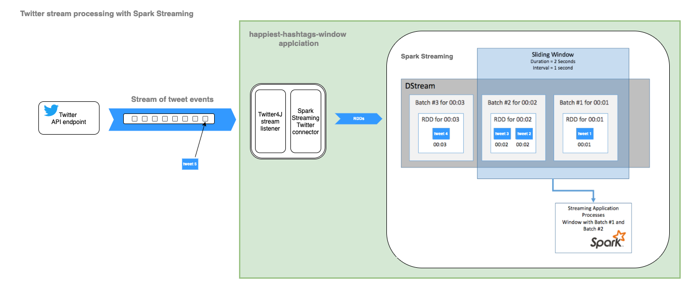
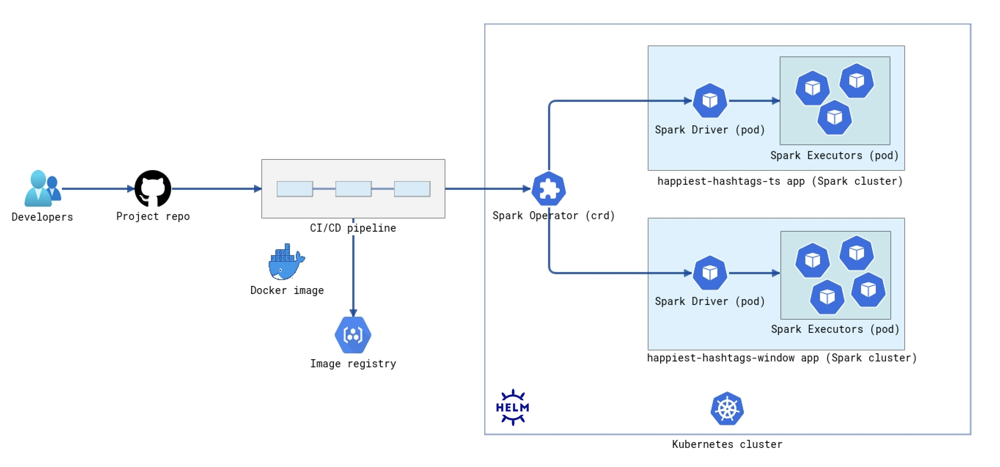

# Twitter Analytics

Note: Structure of the Spark Scala applications is taken from [following repository](https://github.com/godatadriven/scala-spark-application) (thanks to author: Tim van Cann from GDD)

This repository contains simple "real-time" Spark Streaming processing pipeline which produce list of top N hashtags added on Twitter which tweeted statuses had the most smiles in past 1 hour.

The project has Spark streaming applications which processing data consumed from Twitter's Streaming API. In order to read stream from Twitter API we use [Spark Streaming Twitter Connector](https://github.com/apache/bahir/tree/master/streaming-twitter)

__NOTE:__ We use developer access to Twitter APIs which has limits on the number of requests!


## Functionalities build in this project

We have two main functionalities which are part of this project:

### 1. __Event Timestamp based aggregation__:
Implemented in `HappiestHashtagsTsBased.scala` which connects to Twitter API and finds top N hashtags evaluating the time when the tweet was created. If we have some late events in the stream from Twitter API we will not include in the transformations.
Here we use Spark Dataset APIs for transformations over streamed data.

In this functionality we are interested to see top N happiest hashtags based on number of smiles which are in the tweeted status, more precisely we look for patterns which are equal to ':)'.

In order to present functionality for persisting results on storage, in this functionality we save the output from each micro-batch into CSV file.

Use following script to test this functionality: spark submit command with: ```./submitTask1.sh```.

### 2. __Sliding window aggregation__:
Spark streaming application `HappiestHashtagsWindowBased.scala` where aggregations are done using sliding windows. We can pick any window and sliding interval.

In this functionality we are interested to see top N happiest hashtags based on number of smile emojis which are in the tweeted status. Tweets should be written on EN language.
Here we perform transformations and window operations on Discretized Streams (DStreams).

The end result is the top N happiest hashtags within each window printed on terminal.

Use following script to test this functionality: spark submit command with: ```./submitTask2.sh```.

### Solution Diagram of sliding window aggregation functionality

On following diagram we present components involved in the streaming pipeline of second functionality __sliding window aggregation__:



## How to test processing pipelines

All Spark Streaming applications are covered with two types of test:
- _Integration tests_: we test read and write (I/O part of the apps) to filesystem.
- _Unit tests_: we test logic of transformations which we implement over input data.


## How to run Spark streaming applications

To run the applications, you need Docker engine on local machine.
You need to clone the repository and build docker image with added all dependencies in the image.

Process of executing pipeline without setup environment is manual by executing bellow given commands for building Docker image and execute Spark streaming applications.

### Build docker image and test locally
```shell
docker build -t twitter-analytics -f Dockerfile .
```
### Run docker and execute Spark jobs
```shell
# docker run in interactive mode
docker run --rm -it twitter-analytics
```
Inside docker container we need to executed following bash commands in order to start application:

### Functionality 1: Event Timestamp based aggregation
```shell
# submit HappiestHashtagsTsBased job
./opt/scripts/submitTask1.sh

# check for output data from that job on following location
ls /usr/local/data/prod/output/event-ts-based/
```

### Functionality 2: Sliding window aggregation
```shell
# submit HappiestHashtagsWindowBased job
./opt/scripts/submitTask2.sh

# check for output data from that job on command line
```
__Note:__ This Spark applications should be terminated manually because is constantly waiting for new streamed data from Twitter API.


## Deployment

The CI/CD pipeline and simple overview of the infrastructure used to deploy the applications is given of following diagram:

### Setup environment

[WIP]: The setup steps are not fully tested but based on design will work.

You need already installed [Docker](https://www.docker.com/get-started) in order to setup environment for deployment. Please follow steps for setting up environment where applications will be deployed.

#### 1. Install Minikube [macOs]
[minikube](https://minikube.sigs.k8s.io/docs/start/) is local Kubernetes, focusing on making it easy to learn and develop for Kubernetes.

```shell
brew install minikube
# If which minikube fails after installation via brew, you may have to remove the old minikube links and link the newly installed binary:

brew unlink minikube
brew link minikube
```

#### 2. Star Minikube
```shell
minikube delete -p '' # apparently I had some previous unnamed profile
minikube start --driver=virtualbox --memory 8192 --cpus 5 --mount-string /tmp/spark:/data --mount --kubernetes-version v1.20.2

```

#### 3. Create registry where we will push images
```shell
minikube addons enable registry

docker run --rm -it --network=host alpine ash -c "apk add socat && socat TCP-LISTEN:5000,reuseaddr,fork TCP:$(minikube ip):5000"
```

#### 4. Build amd push image including Spark jars
```shell
docker build -t twitter-analytics -f Dockerfile .

docker tag twitter-analytics localhost:5000/twitter-analytics

docker push localhost:5000/twitter-analytics
```

#### 4. Install Spark Operator on K8s
[Spark Operator](https://github.com/GoogleCloudPlatform/spark-on-k8s-operator) is Kubernetes operator for managing the lifecycle of Apache Spark applications on Kubernetes. Here are steps to install and configure:
This step requires to have already [installed Helm](https://helm.sh/docs/intro/install/) which is used to you manage Kubernetes applications: Helm Charts help you define, install, and upgrade even the most complex Kubernetes application.


```shell
./deploy/install-spark-op.sh

# or just run following script
kubectl create namespace spark-op
kubectl create namespace streaming

helm install so-spark spark-operator/spark-operator --namespace spark-op \
--set batchScheduler.enable=true \
--set image.tag=$sparkOperatorVersion \
--set webhook.enable=true \
--set webhook.namespaceSelector="namespace=streaming" \
--set metrics.enable=true \
--set sparkJobNamespace=streaming \
--set logLevel=3

kubectl create serviceaccount so-spark

kubectl create clusterrolebinding spark-role --clusterrole=edit --serviceaccount=default:so-spark

```

### Deploy - Submit Spark jobs

Before we deploy the applications, we need to set up CI/CD process which includes above mentioned steps but also we need to include Quality Code scan and Security scan of Docker images which are not part of this project.

We can set up the CI/CD steps, so the applications will be redeployed automatically or manual on each merge request. This is also not part of this project.

Configuration of the applications is kept in YAML files which are used during the process of deployment. Here is location of YAML files and commands for deployment of the applications to the Kubernetes cluster:

```shell
kubectl apply -f ./happiest-hashtags-ts.yml

kubectl apply -f ./happiest-hashtags-window.yml

```

Following commands can be used to see logs of execution of the applications:

```shell
# gives logs of running app
kubectl -n streaming logs happiest-hashtags-ts-driver -f
# access to WebUI of Spark running app on localhost:5050
kubectl -n streaming port-forward happiest-hashtags-ts-driver 5050:4040
```
```shell
kubectl -n streaming logs happiest-hashtags-window-driver -f
kubectl -n streaming port-forward happiest-hashtags-window-driver 5050:4040
```


## Scaling applications

We can scale up/down the applications by adding more Executors (change instances in YAML) in Spark clusters of each application. Each Executor is having one receiver of Twitter stream.
Additionally, we can increase/decrease resources which are used by the applications.
Basically, we will need to change following parameter in deployment YAML files:

```yaml
    executor:
        coreRequest: "200m"
        coreLimit: "2000m"
        instances: 2
        memory: "4g"
        memoryOverhead: "1g"
```

## Monitoring and alerting

Performance of the applications should be monitored together with alerting functionality using Prometheus and Grafana. This is not presented in this project (or will be added in future).

